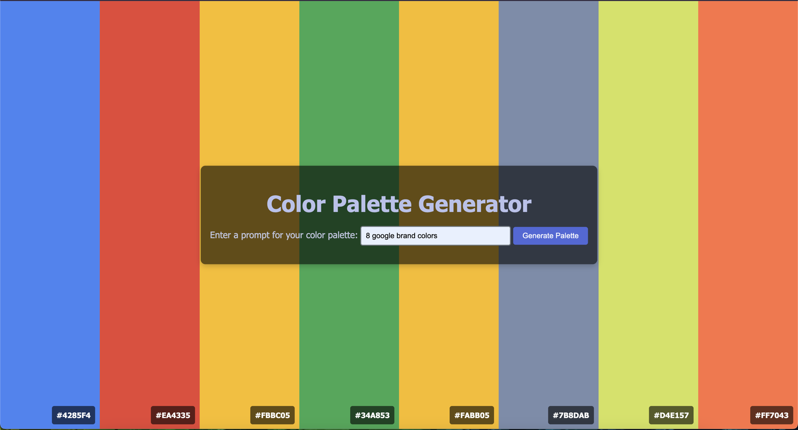

# Color Palette Generator using GPT-4


## Overview

The **Color Palette Generator** is a web-based application that allows users to generate color palettes by providing descriptive text prompts. It leverages OpenAI's GPT-4 API to generate a palette of up to 8 colors, displayed in full-height columns with corresponding hex codes. Users can copy the hex codes to the clipboard with a simple click.

This project is built using **Python** and **Flask** for the backend, and **HTML**, **CSS**, and **JavaScript** on the frontend. It uses the GPT-4 API to process natural language descriptions of color palettes, returning a list of hexadecimal color codes to render visually.

## Features

- Generate a color palette based on user-provided text prompts (e.g., "beach sunset", "forest tones").
- The palette displays as full-height color columns, with each column representing a color.
- Hex codes are shown at the bottom of each color column.
- Click a color column to copy the hex code to the clipboard.
- Clean and elegant UI with centered input form and dynamic display of color results.

## Demo

Here's a screenshot of the application in action:



## Technologies Used

- **Backend**: Flask (Python)
- **Frontend**: HTML, CSS, JavaScript
- **API**: OpenAI GPT-4
- **Styling**: Custom CSS inspired by the Vapor Bootswatch theme

## Installation

### Prerequisites

Make sure you have the following installed:

- Python 3.7+
- A valid API key from [OpenAI](https://beta.openai.com/signup/)

### 1. Clone the repository

```bash
git clone https://github.com/Breedlove-Jason/color_palette_gen_gpt.git
cd color_palette_gen_gpt
```
Create and activate a virtual environment
```bash 
python -m venv venv
source venv/bin/activate  # On Windows: venv\Scripts\activate
```
Install the required dependencies
```bash
pip install -r requirements.txt
```
Set up OpenAI API Key
```bash
OPENAI_API_KEY=your_openai_api_key_here
```
Run the application
```bash
flask run
```
The app will now be running locally at http://127.0.0.1:5000/.

- Open your browser and navigate to http://127.0.0.1:5000/.
- Enter a descriptive text prompt into the input field (e.g., "tropical sunrise").
- Click the "Generate Palette" button.
- A color palette will be generated, with each column representing a color. Hex codes are displayed at the bottom of the columns.
- Click any color column to copy the corresponding hex code to your clipboard.

This application uses the OpenAI GPT-4 API to generate the color palettes. Here's an example of the prompt structure sent to the API:
You are a color palette generating assistant that responds to text prompts for color palettes. You should generate color palettes that fit the theme, mood, or description of the text prompt. The color palette should be a list of hexadecimal color codes between 2 and 8 colors.

Text: <USER_INPUT>

Result: ["#FFFFFF", "#000000", "#FF0000", ...]

Contributing
Contributions are welcome! If you want to contribute, please follow these steps:

Fork the repository.
Create a new branch for your feature/bugfix.
Commit your changes and push the branch to your fork.
Open a pull request and describe your changes.
License
This project is licensed under the MIT License. See the LICENSE file for more information.